# OSINT - UIUCTF 2024

By `BrilliantDeviation7` from team `zwsp`

## Table of Contents

In the order in which I solved these challenges

- [Chunky Boi](#chunky-boi)
- [New Dallas](#new-dallas)
- [Night](#night)

## Chunky Boi

The main subject of this photo ("Chunky Boi") is the gray cargo aircraft, most likely a U.S. military plane. Searching the internet for the numbers which can barely be seen on the tail of the plane tells us that this is the [07-7182 United States Air Force Boeing C-17A Globemaster III](https://www.planespotters.net/airframe/boeing-c-17a-globemaster-iii-07-7182-united-states-air-force/e24v2d).

This gives us the plane type. Flight history for this plane can be found, but the two Alaska Airlines planes is also enough to find this airport.

The only two passenger planes we see are owned by Alaska Airlines. After a quick search, [Wikipedia tells us](https://en.wikipedia.org/wiki/Alaska_Airlines) that the airline operates out of its primary hub of Seattle–Tacoma International Airport.

Let's visit this airport in Google Earth.

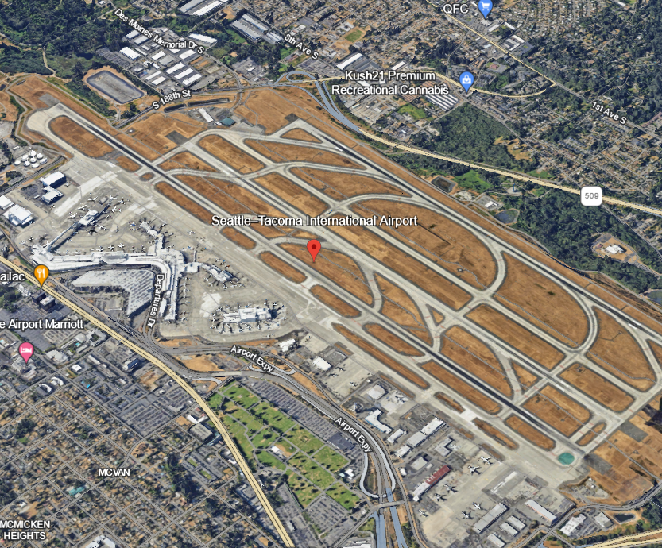

A prominent feature of the original image is the red building in the background. We can quickly find this at the northern end of the airport.

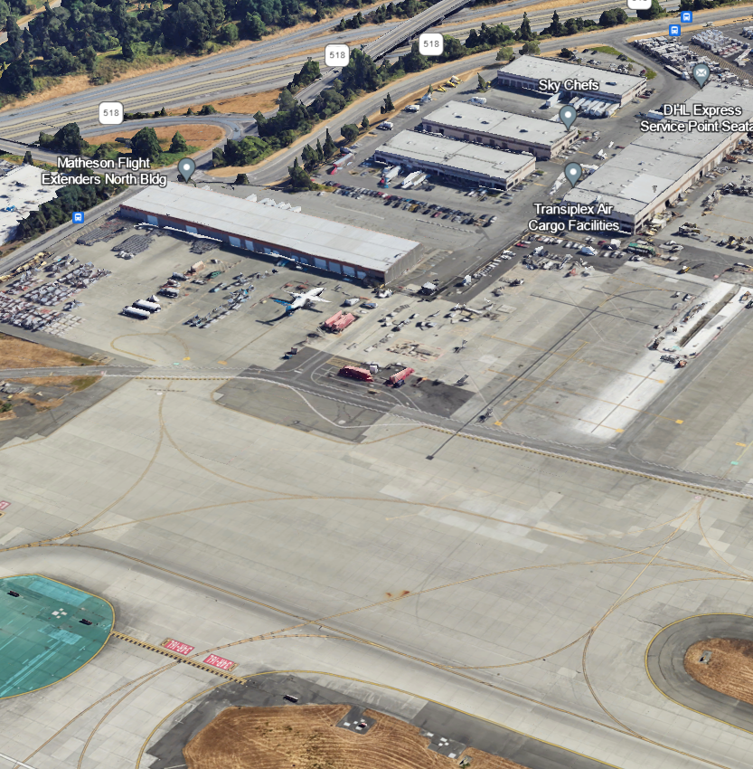

Right click on the approximate location to copy the coordinates and then convert to decimal coordinates with an online tool.

The flag is `uiuctf{Boeing C-17 Globemaster III, 47.462, -122.303}`. Note that it is `C-17`, not `C-17A` because the challenge says to use the Wikipedia page title.

## New Dallas

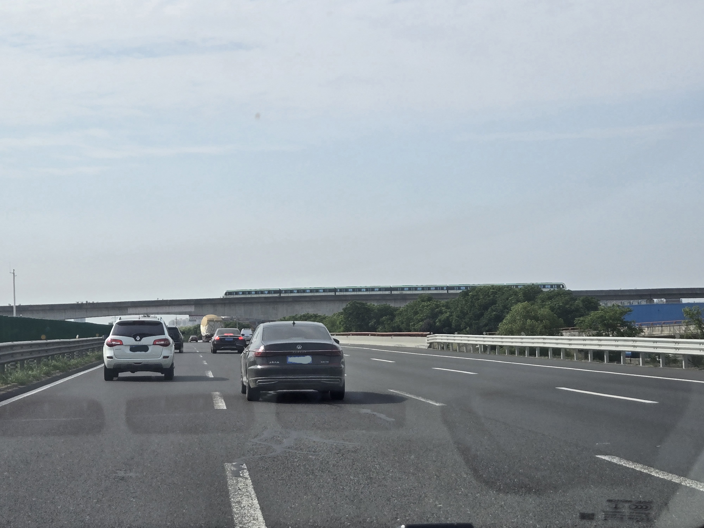

At first glance, this felt like China. I've been to the city, but I did not know this when I started this challenge.

First, I looked at the cars; the blue license plates pretty much confirmed that it was China. You can also notice the Chinese character at the front of the blue license plate or the characters on the distant red sign to realize that this is an Asian country.

Then, I looked at the train. The first one that came to mind was the Shanghai maglev, but it does not have the same shape and green highlights.

I tried everything from reverse image searching the entire image and just the train (which gave a bunch of results in Europe), but Bing (yes, I use Bing) did not return anything useful.

I was not so hopeful because China has a lot of massive cities and therefore many metro networks, so I had to narrow it down to the city.

I searched "china elevated subway" and "china metro" on Bing to try to find the green train on the bridge, but I couldn't find anything similar.

### Another Search Engine

Then, I thought to use a Chinese search engine, Baidu, which conveniently also has reverse image search.

The entire photo returned a lot of similar pictures of roads from Chinese social media, but these were unhelpful because they did not narrow down the city or include the train.

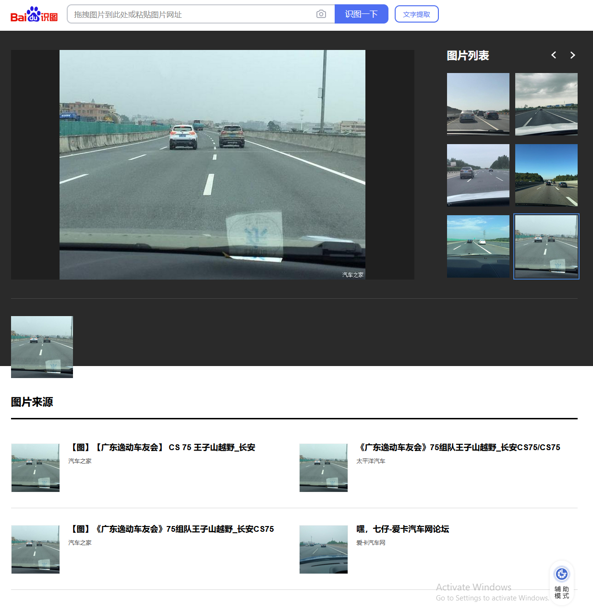

This result had a similar bridge, but the source was not helpful.

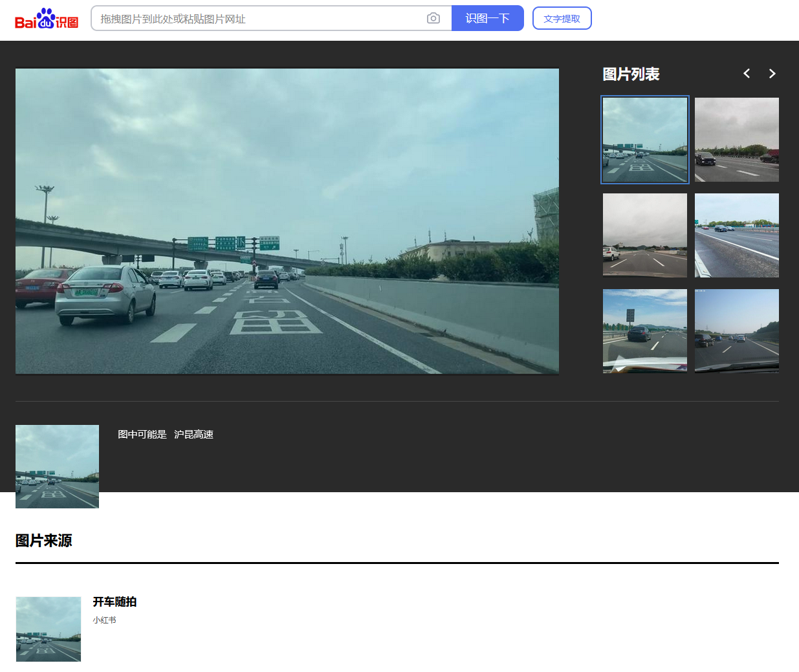

I also found this photo, which had a train on a bridge, but the shape of the train suggests it is not the same metro line.

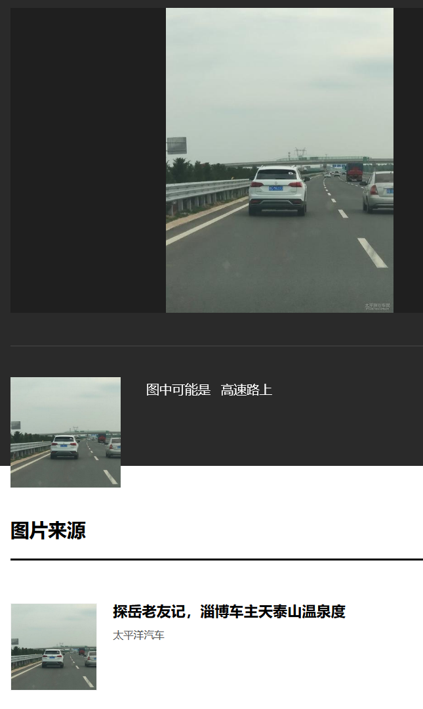

I then uploaded just a cropped section of the train. One of the results was a photo of the Wuxi Metro Line 2 according to the social media sources.

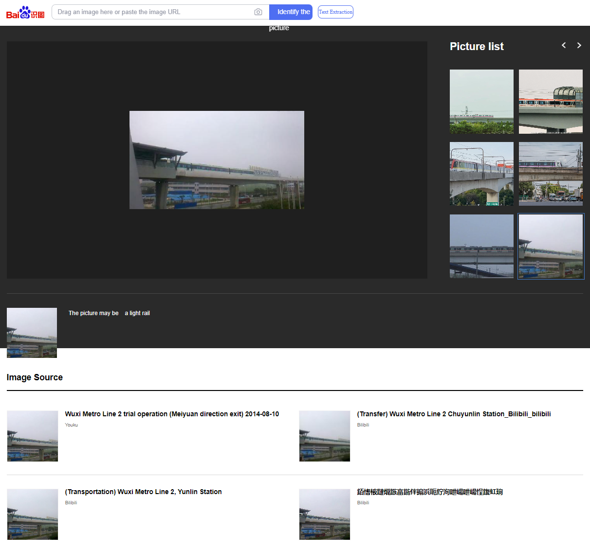

Once I knew that it was in Wuxi, I looked up the [Wuxi Metro Line 2](<https://en.wikipedia.org/wiki/Line_2_(Wuxi_Metro)>) to confirm the green color. I found the line on Google Maps, and then looked for where this line met a 4-lane highway.

I was concerned about the GPS shift in China on Google Maps at first, but I just used the coordinates according to the labels, not the satellite imagery.

Right click on the intersection of the highway and the metro line (green) to get the coordinates. The location is closer to the eastern end of the line.

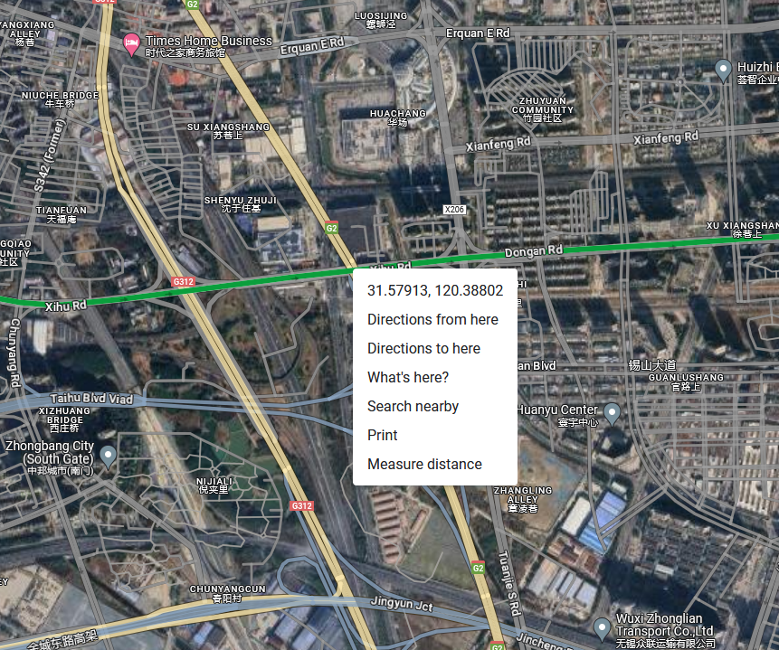

The flag is `uiuctf{31.579, 120.388}`

As team `zwsp`, we were the second solve, after `r3kapig`.

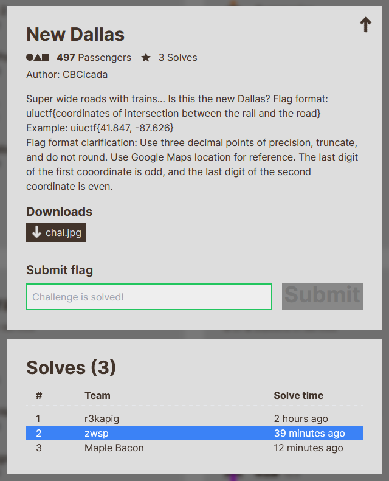

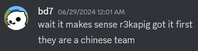

But I had already realized that we needed to look in China.

### Other resources and interesting alternative methods

- [OpenStreetMaps and overpass turbo](https://discord.com/channels/722150434566963293/1257123787397398541/1257124697607241748)
- [Location-based OSINT](https://sigpwny.com/meetings/sp2024/2024-04-14/)

## Night

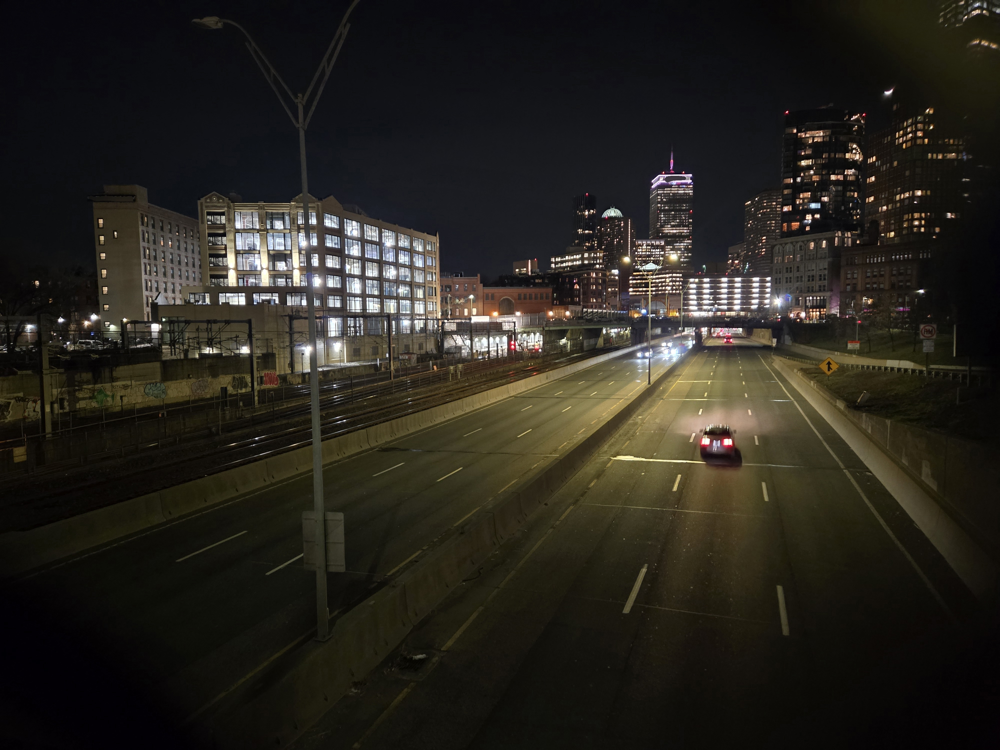

I knew this skyline immediately, but reverse image searching the buildings in the background should also tell you that this is `Boston`, with the distinctive Prudential Tower and "R2D2" building. You can also see commuter rail tracks on the side, which should narrow down the highways that go into Boston.

You will find Interstate 90 on Google Earth near these two buildings, with train tracks beside it.

We look for the two buildings on the left in the picture.

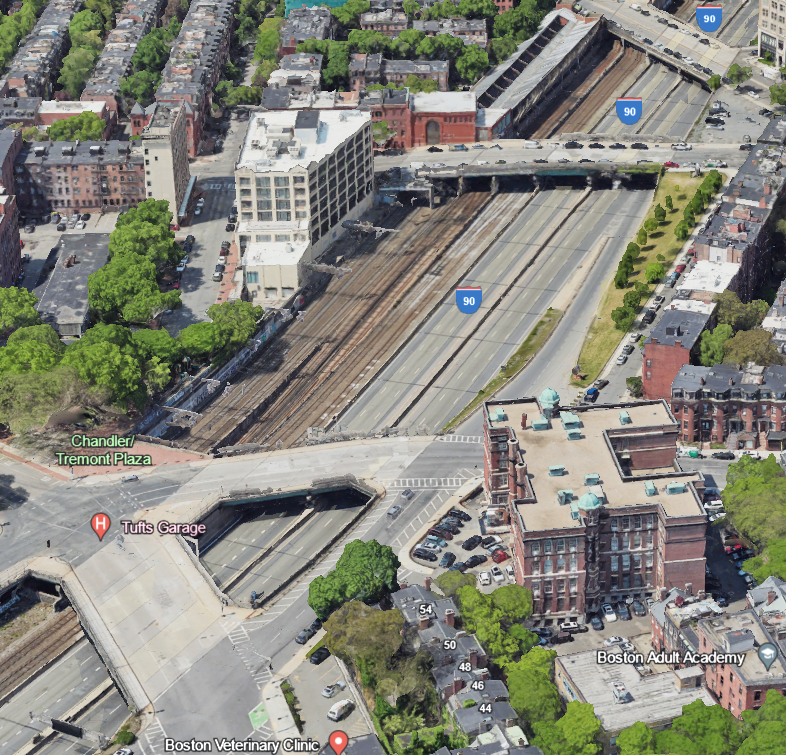

We have found them here because they have the distinct shape and window layout (especially the narrow building on the left).

We check the name of the overpass second from the bottom in the above screenshot to find the street name, `Arlington Street`.

The flag is `uiuctf{Arlington Street, Boston}`
