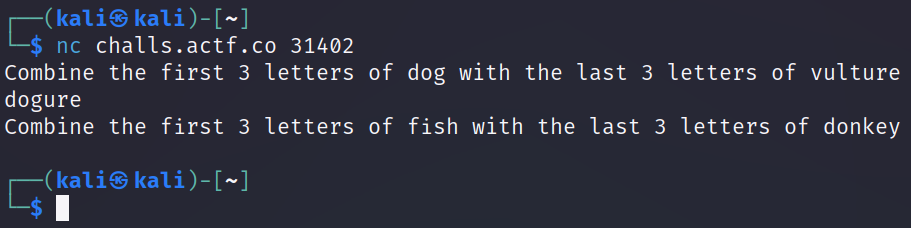

# ångstromCTF-2023 MISC Challenges

## Physics HW

We are given an image:


I was tempted to start solving the problems lol, but steganography was the more likely solution.

Uploading the image to https://stylesuxx.github.io/steganography and using the "Decode" tab gives the flag.

## Admiral Shark

We get a file: `admiral_shark.pcapng`. We first `strings admiral_shark.pcapng`, and find some Star Wars references. I saw some file names in there, so I'll `binwalk -e admiral_shark.pcapng`. Looking through the folder of extracted files, we find that the flag is inside `xl/sharedStrings.xml`.

## Simon Says

We use the netcat command from the challenge to explore the challenge. It tells us to combine the first 3 letters of an animal and the last 3 of another animal. Of course, we try this and send the answer. If it's correct, we'll realize that the connection quickly times out, so we'll need to be faster by automating it.

Look into [pwntools](https://github.com/Gallopsled/pwntools) and [pwntools tutorials](https://github.com/Gallopsled/pwntools-tutorial#readme) for help understanding the code below.



```python
from pwn import *

host = 'challs.actf.co'
port = 31402

r = remote(host, port)

# Keep receiving responses from server
while True:
    response = r.recvline()
    print(response)

    # Split server response into words
    response = response.split()

    # Show our response (first 3 letters of 7th word + last 3 of 14th word)
    print((response[6][:3] + response[13][:3]))

    # Check if the response contains a specific string
    if b'Combine' in response:
        # Send the correct answer to the server
        r.sendline((response[6][:3] + response[13][-3:]))
    else:
        break

# Close the connection to the server
r.close()
```

## better me

This challenge probably had the most creative solutions since it involved extracting the flag from an AI chatbot that was instructed to keep the flag secret. We notice that it always responds with the name of a contest organizer, so telling it that we are that person allows you to ask for and get the flag.
